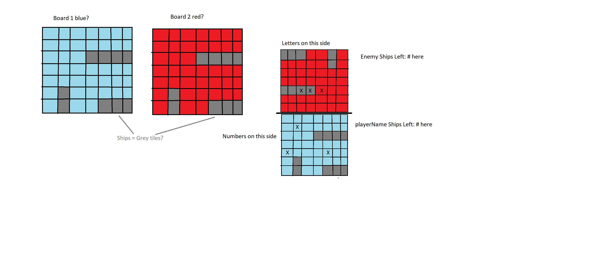

# Battleship (possible project name change at later date)

## About this project

- A coding project based on the game Battleship
- Replication/rendition using HTML/CSS/JS
- See below pseudocode for initial rough draft/implementation


```css
board1 {
    grid-template-columns: find out how many we need;
    grid-template-rows: find out how many we need;
    background-color: blue; "maybe make board blue like water?"


board2 {
    this will be copy/paste of above board1 but will be placed opposite board1 and act as the "enemy" board.
    background-color: red; "maybe cool to make enemy board red?"
}
```

```js
"playerName = have someone add their name in?
let ship1Size = "use realistic grid sizing. something like 1x2"
let ship2Size = "use realistic grid sizing. something like 1x3"
let ship3Size = "use realistic grid sizing. something like 1x4"
let ship4Size = "use realistic grid sizing. something like 2x3"
let ship5Size = "possible extra large ship size? 2x4 or 3x5? determine size later"
"determine total number of ships/board pieces to use at later date"

function gameInit() {
    "create array/list of all possible board spots"
    function compPlaceShips() {
        "create ability to randomly place ships1-5"
        "create logic to ensure randomly selected spots do not overlap ships"
    }
}
function placeShip("queryselect where the player places ship") {
    "run a function here that adds a ship to board1"
}

function hitLogic("spot chosen argument") {
    if "queryselect spot that is selected" === "shipPlacedHere" {
        "place a hit marker on enemy ship spot"
    } else {
        "place a miss marker on spot that was selected"
    }
}

function swapTurn() {
    if ("player has taken a turn") {
        "swap to computer turn"
    } else if ("computer has taken a turn") {
        "swap to player turn"
    }
}

function playerAttack("queryselect spot chosen") {
    hitLogic("queryselect spot chosen")
    swapTurn()
}

function computerAttack() {
    "create array/list of all possible board choices"
    let compChoice = "create ability to choose randomly from above choices"
    hitLogic(compChoice)
    swapTurn()
}
```